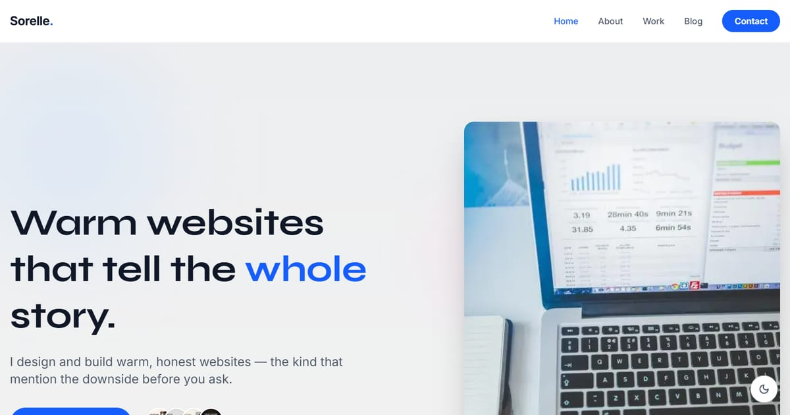

# Sorelle — UI/UX Designer & Developer

Portfolio template for Sorelle, a fictional UI/UX designer and developer: bright case studies that link to six live demo sites for families, learners, and makers, plus notes on honest copy, games that stop, and drawings made to measure.

**Demo live:** https://portfolio-sorelle.vercel.app



> Template portfolio dengan persona fiktif. Semua proyek di dalamnya adalah demo live dari koleksi yang sama; tidak ada klien, testimoni, atau logo merek sungguhan. Formulir kontak hanya demo dan mengatakannya.

## Konsep

Persona fiktif Sorelle, desainer UI/UX. Bersih dan terang dengan angka bernomor besar, ubin karya, dan aksen hangat; mode gelap membalik kertas jadi arang.

## Isi

- **6 studi kasus** (`/work/[slug]`): tantangan, yang dikerjakan, hasil, dan tautan ke situs live-nya.
- **3 artikel** (`/blog/[slug]`) tentang keputusan desain di proyek-proyek tersebut.
- Angka yang tampil (jumlah proyek, layanan, artikel) dihitung dari isi situs; lama berkarya adalah bagian dari persona fiktif. Tidak ada klaim jumlah klien atau tingkat kepuasan.
- Halaman 404 bergaya sendiri, judul halaman berpola `Halaman — Sorelle`, dan sitemap memuat setiap studi kasus dan artikel.

| Studi kasus | Demo live |
| --- | --- |
| Beranda | https://properti-beranda.vercel.app |
| EduPlay | https://landing-eduplay.vercel.app |
| Woodora | https://landing-woodora.vercel.app |
| Elevinar | https://landing-elevinar.vercel.app |
| NextTalks | https://landing-nexttalks.vercel.app |
| Kayla’s birthday | https://undangan-birthday.vercel.app |

## Halaman

`/` · `/about` · `/work` · `/work/[slug]` · `/blog` · `/blog/[slug]` · `/contact`

## Gambar & kredit

- `public/images/work/*.webp` — tangkapan layar demo live di tabel atas (karya koleksi ini sendiri).
- `public/images/hero.webp` — "Office Work" oleh Negative Space, [StockSnap](https://stocksnap.io/photo/office-work-8P6GFHP0LU), lisensi CC0.
- `public/images/about.webp` — "Office Work" oleh kontributor StockSnap (nama tidak dicantumkan di Openverse), [StockSnap](https://stocksnap.io/photo/office-work-PE894KZLRX), lisensi CC0.

## Teknologi

- Next.js 15.5 (App Router) dan React 19
- Tailwind CSS v4
- JavaScript
- Framer Motion, Lucide (ikon), next-themes (mode gelap/terang)
- Font: Inter, Syne (next/font)
- SEO: metadata per halaman, Open Graph, JSON-LD (WebSite), sitemap.xml, dan robots.txt

## Menjalankan secara lokal

```bash
npm install
npm run dev
```

Buka http://localhost:3000. Untuk build produksi: `npm run build` lalu `npm start`.

---

Bagian dari koleksi 7 template portfolio personal di [PortalPorto](https://portal-porto-neon.vercel.app). Dibuat oleh [PintuWeb](https://www.pintuweb.com), jasa pembuatan website.
